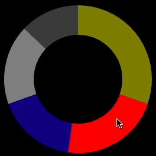

# react-small-donut-chart
A small SVG React component to generate a Donut Chart!

# How it looks



# Install

```
npm install react-small-donut-chart
```

# Usage

```js
import DonutChart from 'react-small-donut-chart';
```

```jsx
<DonutChart
  strokeWidth={50}
  colors={['yellow', 'red', 'blue', 'white', 'grey']}
  values={[32, 56, 24, 40, 32]}
  radius={150}/>
```